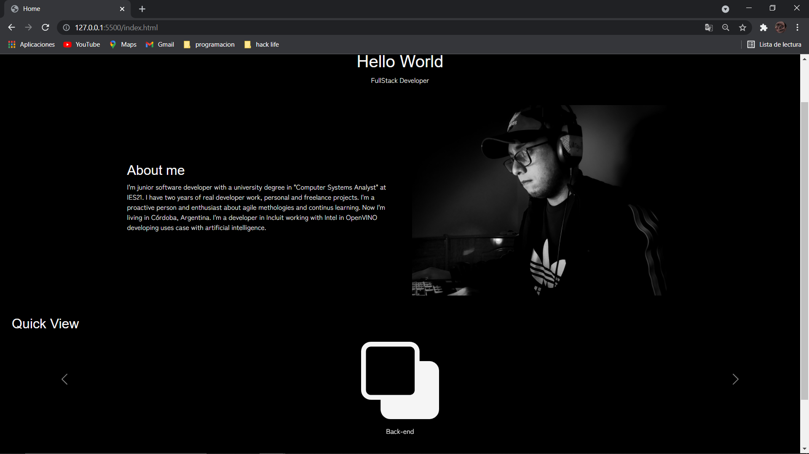
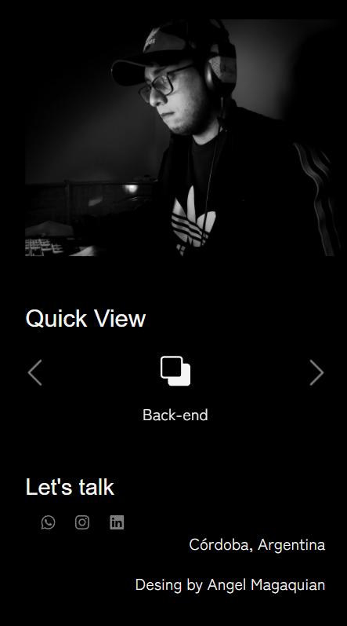
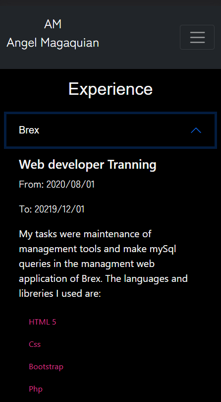

# Angel Magaquian Portfolio

## `Get Started`:

Este proyecto esta desarrollado con las tecnologias web basicas, por lo que es encontrara con:

-HTML 5.

-Css y Sass.

-Bootstrap 5, puede ver la documentación de este framework haciendo [Click Aquí](https://getbootstrap.com/docs/5.0/getting-started/introduction/).

-Bootstrap 5 fue implementado en el proyecto por medio de npm por lo que deberá instalarlo en su computadora si desea replicar este codigo, para ello siga los siguientes pasos:

-Instalar y configurar `node` haciendo [Click Aquí](https://nodejs.org/en/). Se peude verificar la instalación con el comando `npm -v` en el CLI. Una vez instalado node, podemos clonar del repositorio el proyecto y abrirlo en nuestro editor de codigo.
    
    git clone https://github.com/AngelMagaquian/web-dev.git

## `Sobre el proyecto`

>Este es un proyecto de desarrollo web donde se empleó mayor mente `HTML 5`, `Bootstrap`, `css` y `Sass`.
La finalidad de este desarrollo es demostrar mi experiencia y conocimiento adquirido sobre las tecnologias web creando una pagina basica
como protfolio personal.

Actualmente el proyecto se encuentra en la version 0.1.0 donde la finalidad de mostrar al usuario el contenido se puede cumplir de manera exitosa. 

>Tambien este proyecto es totalmente responsive mobile first gracias a Bootstrap.

## `Paleta de colores`

La paleta de colores es claramente una escala de grises pero poseé un color rosa saturado el cual logra un buen contraste pero no se exagera en su uso.
-negro: #0000
-blanco: #f5f5f5
-gris: rgb(124, 124, 124)
-gris oscuro: rgb(109,112,114)
-rosado: #d63384

## `Wireframes`

Como complemento para documentación me parece importante adjuntar los wireframes diseñados previamente al desarrollo del proyecto. Se empleo el software balsamiq para su diseño. Para poder acceder se debe hacer [Click Aquí](https://drive.google.com/file/d/1DqDayEllOo0dxBlHxSsgOYPShR4aoVF9/view?usp=sharing) donde lo llevara a google drive donde se encuentra el documento en formato PDF.

## `Servidor`

Este proyecto esta subido por el momento en Netlify el cual es facil de realizar deploys por su vinculación directa a github. Se puede acceder haciendo [Click Aquí](https://focused-lumiere-82ffd7.netlify.app/)

## `Repositorio`

El repositorio que se usa actualmente es GitHub donde se encuentra la ultima versión actualizada con commits en el branch master. El proyecto es de caracter público por lo que puede ser clonado por cualquier usuario.

Para ingresar al repositorio hace [Click Aquí](https://github.com/AngelMagaquian/web-dev)
